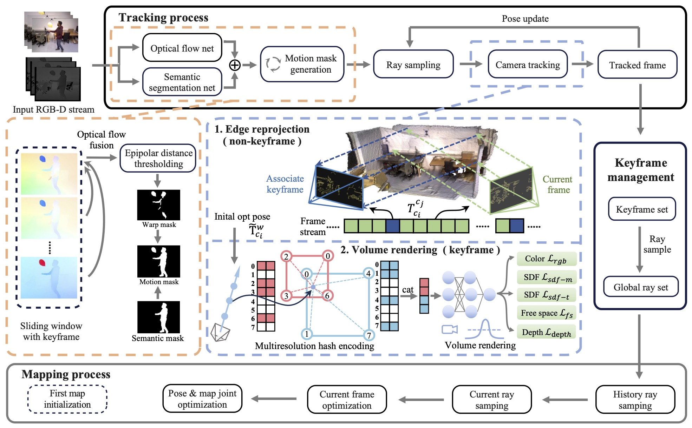

# RoDyn-SLAM: Robust Dynamic Dense RGB-D SLAM with Neural Radiance Fields
### [[Paper]](https://arxiv.org/abs/2407.01303) 

> [**RoDyn-SLAM: Robust Dynamic Dense RGB-D SLAM with Neural Radiance Fields**](https://arxiv.org/abs/2407.01303),            
> Haochen Jiang*, Yueming Xu*, Kejie Li, Jianfeng Feng, Li Zhang  
> **IEEE RAL 2024**

**Official implementation of "RoDyn-SLAM: Robust Dynamic Dense RGB-D SLAM with Neural Radiance Fields".** Leveraging neural implicit representation to conduct dense RGB-D SLAM has been studied in recent years. However, this approach relies on a static environment assumption and does not work robustly within a dynamic environment due to the inconsistent observation of geometry and photometry. In this paper, we propose a novel dynamic SLAM framework with neural radiance field. Specifically, we introduce a motion mask generation method to filter out the invalid sampled rays. This design effectively fuses the optical flow mask and semantic mask to enhance the precision of motion mask. To further improve the accuracy of pose estimation, we have designed a divide-and-conquer pose optimization algorithm that distinguishes between keyframes and non-keyframes. The proposed edge warp loss can effectively enhance the geometry constraints between adjacent frames.

## 🚀 News

- **(2024/11/14)** Our latest work, [DG-SLAM](https://arxiv.org/abs/2411.08373), a 3D GS-based SLAM system for dyanmic scenes, has been accepted for a poster presentation at NIPS 24. We will be discussing it at the conference and welcome everyone to engage with our latest work!

- **(2024/11/12)** The basic version of code is released, including the key part of the proposed SLAM system, i.e. motion mask generation, invalid sample points filter, edge extraction and loss computation, hybrid pose optimization algorithm. 

## 🛠️ Pipeline
<div align="center">
  
</div><br/>

## ⚙️ Installation

Please follow the instructions below to install the repo and dependencies.

```bash
git clone https://github.com/fudan-zvg/Rodyn-SLAM.git
cd Rodyn-SLAM
```

### Install the environment

```bash
# Create conda environment
conda create -n rodynslam python=3.7
conda activate rodynslam

# Install the pytorch first (Please check the cuda version)
pip install torch==1.10.1+cu113 torchvision==0.11.2+cu113 torchaudio==0.10.1 -f https://download.pytorch.org/whl/cu113/torch_stable.html

# Install all the dependencies via pip (Note here pytorch3d and tinycudann requires ~10min to build)
pip install -r requirements.txt

# Build extension (marching cubes from neuralRGBD)
cd external/NumpyMarchingCubes
python setup.py install

# Optical flow environment dependencies
pip install imageio einops
```

If the optical flow method fail to execute successfully, please consult the official repository and accompanying guidance [GMA](https://github.com/zacjiang/GMA). The pretrained weights for GMA can also be downloaded from this repository. The `.path` file should be placed in the `./checkpoints` folder.
## 📂 Download Dataset & Data preprocessing

#### TUM RGB-D Dataset
Download 4 dynamic scene sequences of TUM RGB-D dataset into `./data/TUM` folder.

```bash
bash scripts/download_tum.sh 
```

#### BONN Dynamic RGB-D Dataset
Download 5 dynamic scene sequences of BONN RGB-D dataset into `./data/BONN` folder.

```bash
bash scripts/download_bonn.sh 
```

#### Data preprocessing
- Firstly, you should generate semantic motion mask with [OneFormer](https://github.com/SHI-Labs/OneFormer). For guidance on the environmental setup and execution process for this approach, please refer to the instructions provided on the official GitHub page.  
- Secondly, move these generate mask images to the root path of dataset and create the folder named `./seg_mask`  
- Thirdly, (Optional) offline to generate more precise final fusion motion mask with warping optical flow. It should be noted that, in the interest of system integrity, this version of the code includes the complete fusion process, which may lead to slower performance speeds. For the generation of a more precise motion mask, an offline approach is recommended.

## 🔄 Run
You can run Rodyn-SLAM using the code below:

```
python rodynslam.py --config './configs/{Dataset}/{scene}.yaml 
```

## ✅ TODO
- [x] Basic code release.
- [ ] Scripts for data preprocessing.
- [ ] Scripts for visualization.


## 🎥 Videos
### 🎞️ Demo
[](https://www.youtube.com/embed/Z7jtT3_wgwc)

## 📜 BibTeX
If you find our code or paper useful for your research, please consider citing:
```bibtex
@article{jiang2024rodynslam,
  title={RoDyn-SLAM: Robust Dynamic Dense RGB-D SLAM with Neural Radiance Fields},
  author={Jiang, Haochen and Xu, Yueming and Li, Kejie and Feng, Jianfeng and Zhang, Li},
  journal={IEEE Robotics and Automation Letters},
  year={2024},
}
```

## Acknowledgement
Thanks to previous open-sourced repo: [NeRF](https://github.com/bmild/nerf), [RodynRF](https://robust-dynrf.github.io/), [Co-SLAM](https://github.com/HengyiWang/Co-SLAM)

## Contact
Contact [Haochen Jiang](jianghc1995@gmail.com) and [Yueming Xu](xuyueming21@m.fudan.edu.cn) for questions, comments and reporting bugs.